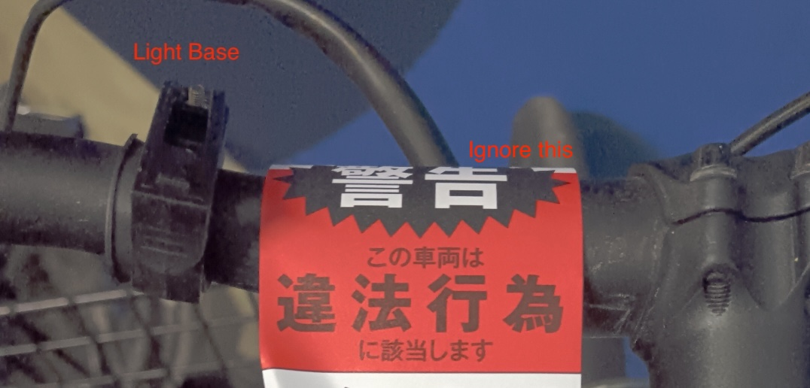
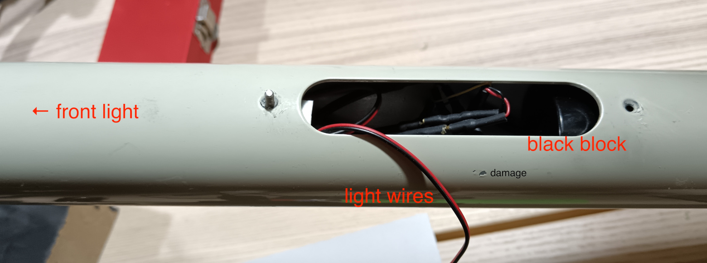
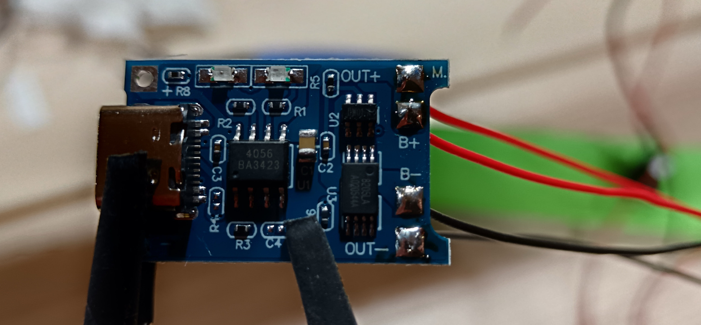
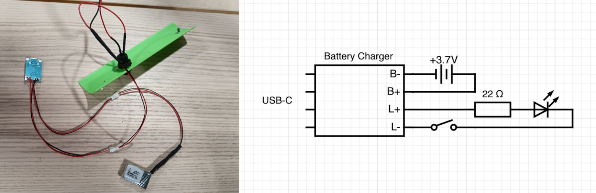
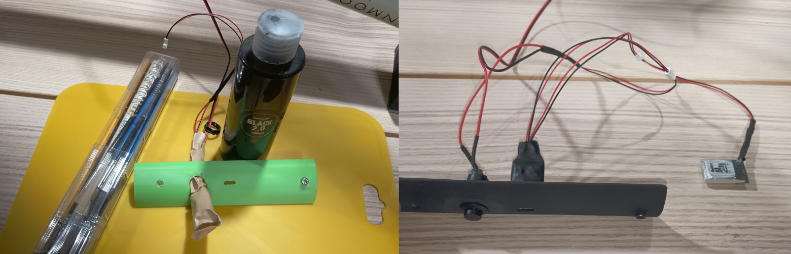
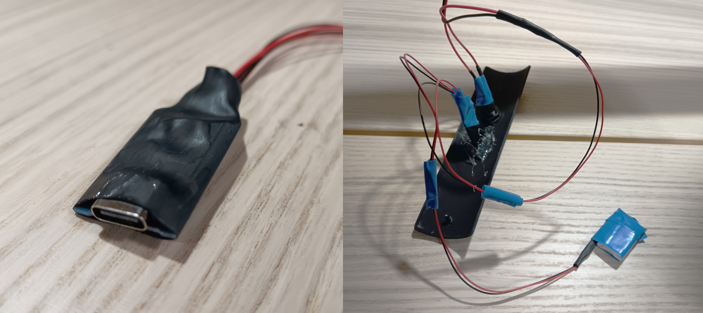
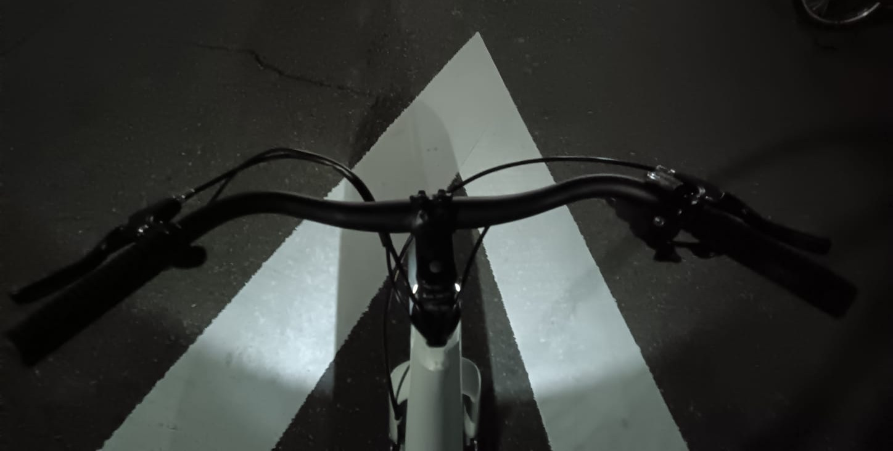
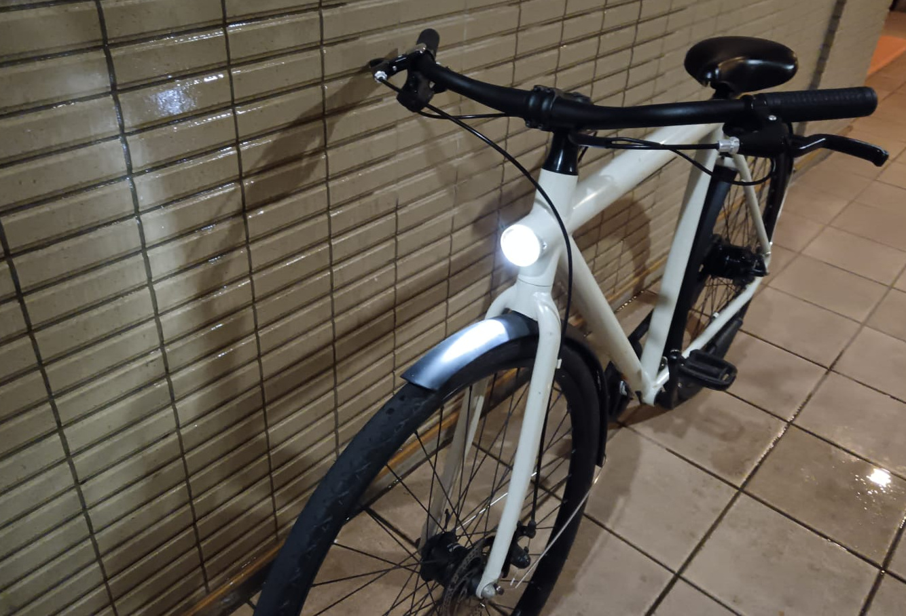

The company that made my bike went bankrupt a few years ago. It isn't truly even my bike, it's my friend's, who bought it God-knows-where, in a country where this company never operated. This friend is no longer here —in this country—[1] so I'm holding it for him and can use it freely.

And it's a fine bike, mind you. But there's a teeny tiny problem:

**The _lights_ don't work without the App**.

Did I mention the company went bankrupt? And the spotty history of the bike? And that Customer Support is in startup heaven? And how ridiculous it is anyway to need to login into an app to turn your light on?

## First solution

You can just get a bike light in Daiso in Japan. It feels funny riding such a solid bike, with a nice integrated non-working light, and using a cheap light that you have to press just right for it to work. But I got my law-abiding light, so kudos.

Not bad until you learn that *there are also thieves in Japan*. Shocker, I know, I was promised safety here but one nice day the light was gone. Someone risked life in prison for a measly $3.5/500円 light. To be fair, I had parked it in the wrong place, and the yen is low.

## Hacking a light

I decided to make the existing embedded light work again, with a simple button. So first I checked the existing setup: there was an embedded light and an internal battery inside an inaccessible black block with a micro-USB charger. If I am hacking things together, I want:

- First and foremost, don't break anything and make it easy to go back.
- Try my new 3D printer if possible. I want to print something useful.
- Keep the existing light so that I don't need weird adaptors.
- Upgrade to USB-C for the charging circuit.
- Make things not too hard to swap (I wasn't sure of the voltages).
- Do not burn my home down. I think this shouldn't be last?

There was a black block inside the frame which I couldn't take out, but I could slide out of the way. The light on the front also had 2 spare connectors, so I soldered some wires. You can see the hole with the light wires sticking out:

I found a USB-C charging board for 3.7V LiPo with 2 connectors for the battery and 2 for the load:

Connected everything and put it on the 3D printed cover, which was a lot easier than I expected:

Now that everything is in place and I tested it and it works, I added the black paint:

<video style="width: 100%;" controls src="./painting.mp4"></video>

Finally added 2 very important features for that last goal, avoiding burning my home down. I shrinkwrapped everything that was fixed, taped every connector, and added a small resistor:

A nice side effect is that the front light and back light were connected, so turning one on would turn the other on as well! I tested it and it seems to work, though from this angle you barely see the light:

<video style="width: 100%;" controls src="./testing.mp4"></video>

## Conclusion

Now my bike has a button, you press it and the light turns on. It's like magic how simple it is! You can also charge this light with USB-C instead of the original micro-USB.

Sometimes the simpler things are just better.

